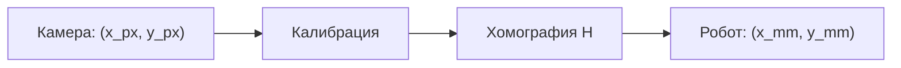
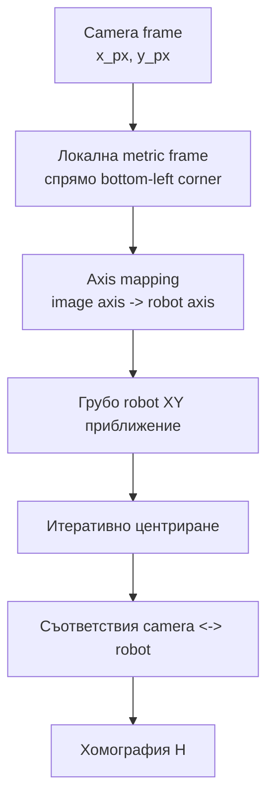
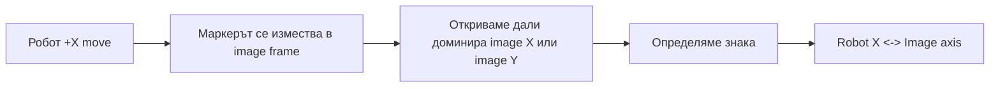
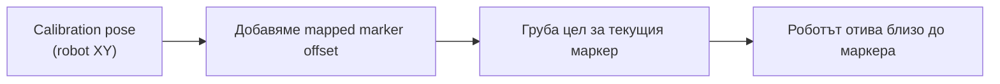
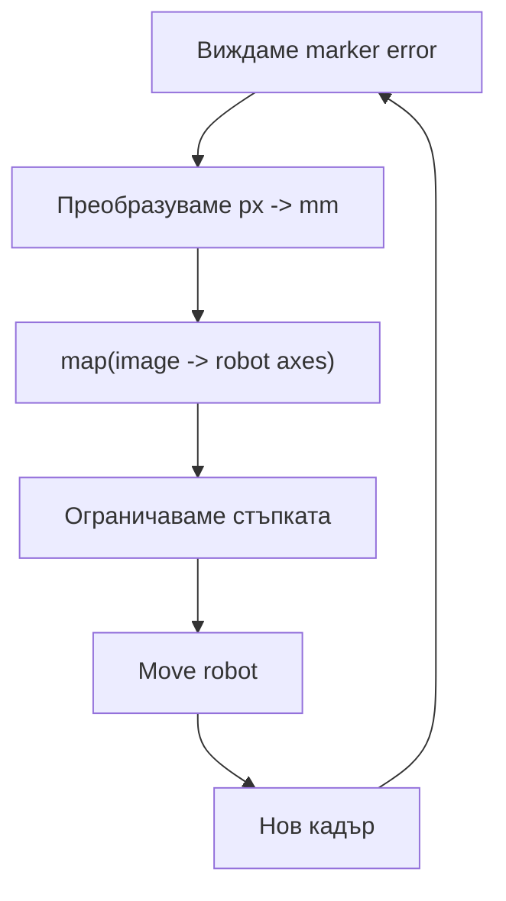
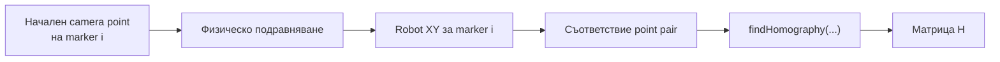

# Подходът на robot calibration

Този документ обяснява геометричната идея зад `src/engine/robot/calibration/robot_calibration/`.
Фокусът е върху координатните системи, междинните пресмятания, логиката на движението и защо роботът може да стигне до маркерите още преди да има пълна хомография.

## Каква е целта

Целта на калибрацията е да се построи преобразуване:

`точка в камерата (px)` -> `точка в робота (mm)`

В кода това завършва като 3x3 хомографска матрица, записана в `camera_to_robot_matrix_path`.

След успешна калибрация всяка точка, видяна от камерата в равнината на работната повърхност, може да бъде преведена в XY координати на робота.



## Основните координатни системи

По време на калибрацията реално се работи с 3 различни представяния:

### 1. Камерен кадър в пиксели

Това е суровото изображение:

- `x_px`: надясно в изображението
- `y_px`: надолу в изображението

Това не е роботна система. Това е само екранна/камерна геометрия.

### 2. Локална метрична система върху шахматната дъска

Тя се създава временно, само за да получим мерни единици още преди хомографията.

- начало: долният ляв ъгъл на шахматната дъска в изображението
- единица: милиметри
- мащаб: чрез `PPM` (pixels per millimeter)

Важно: това пак не е роботна координатна система. Това е временна metric система, подравнена по изображението.

### 3. Роботна система

Тук са реалните позиции на робота:

- `x, y, z` в mm
- `rx, ry, rz` като ориентация

Хомографията в края свързва директно:

`camera pixel frame` -> `robot XY frame`



## Ролята на шахматната дъска

Шахматната дъска се ползва за две неща:

1. Да даде стабилен локален произход в изображението.
2. Да даде мащаб пиксели към милиметри.

Това е причината калибрацията да не започва директно с ArUco маркерите.

## Защо точно bottom-left corner

Кодът избира долния ляв вътрешен ъгъл на шахматната дъска като временен локален произход:

- той е лесно възпроизводим
- лежи в същата работна равнина като маркерите
- не изисква още да знаем нищо за робота

Този ъгъл не е световен произход и не е роботен нула-пункт. Той е само удобна временна референция за прехода:

`пиксели` -> `локални mm върху дъската`

Ако означим:

- `B = (B_x, B_y)` като bottom-left corner в пиксели
- `P = (P_x, P_y)` като произволна точка в изображението

то локалната метрична координата на тази точка е:

```text
x_local_mm = (P_x - B_x) / PPM
y_local_mm = (P_y - B_y) / PPM
```

Това е локална координата върху изображението, не robot координата.

## Как се смята началният PPM

`PPM` се изчислява от шахматната дъска.

Идеята е проста:

1. Откриват се вътрешните ъгли на шахматната дъска.
2. Измерват се разстоянията между съседни ъгли в пиксели.
3. Усредняват се всички хоризонтални и вертикални разстояния.
4. Това средно пикселно разстояние се дели на реалния размер на едно квадратче в mm.

Основната формула е:

```text
PPM = average_square_size_in_pixels / square_size_mm
```

По-разгънато, ако:

- `d_px(i)` е разстоянието в пиксели между две съседни шахматни точки
- `S_mm` е реалният размер на квадратчето в милиметри
- `N` е броят на използваните съседни двойки

тогава:

```text
average_square_size_in_pixels = (1 / N) * Σ d_px(i)

PPM = average_square_size_in_pixels / S_mm
```

и обратното:

```text
mm_per_pixel = 1 / PPM
```

Така получаваме локален мащаб за равнината.

## Какво е в camera frame и какво е в robot frame

### В camera frame

- центровете или ъглите на ArUco маркерите в пиксели
- центърът на изображението
- шахматният ъгъл в пиксели
- всички `camera_points_for_homography`

### В robot frame

- `current_pose`
- `calibration_pose`
- `robot_positions_for_calibration`
- крайните XY точки, към които роботът се движи

### Междинно представяне

- `marker_top_left_corners_mm`
- `markers_offsets_mm`

Тези стойности са в милиметри, но още не са в robot frame.
Те са в локалната метрична система, наследена от изображението и шахматната дъска.

## Защо роботът може да тръгне към маркер преди хомография

Това е най-важната идея в целия подход.

Преди пълната хомография системата все още няма общо 2D преобразуване между камерата и робота.
Но вече знае две по-слаби, но достатъчни неща:

1. мащаба в работната равнина чрез `PPM`
2. кои image оси отговарят на robot X и robot Y чрез `AXIS_MAPPING`

Тази комбинация е достатъчна за първоначално приближение.

## Стъпка 1: axis mapping

Преди да почне реалното подравняване, системата прави кратка калибрация на осите.

Използва се един референтен ArUco маркер:

1. засича се позицията му в изображението
2. роботът се премества с `+MOVE_MM` по X
3. маркерът се засича отново
4. гледа се по коя image ос се е изместил най-силно и в коя посока
5. после същото се прави с движение по Y

Резултатът не е хомография, а само таблица от вида:

- robot X съответства на image X или image Y
- robot Y съответства на image X или image Y
- плюс дали знакът е същият или обърнат

Това се пази в `ImageToRobotMapping`.

Тоест системата научава:

"ако в изображението имам offset, в коя роботна ос трябва да движа и с какъв знак".



Ако при robot движение `ΔX_robot` видим image изместване `(Δx_img, Δy_img)`, системата:

1. избира доминиращата image ос
2. избира знака според това дали движението на маркера в изображението е в същата или в обратната посока

Резултатът е дискретна осева карта, а не непрекъсната геометрична трансформация.

## Стъпка 2: откриване на всички маркери в една обща начална камера поза

След това системата:

1. стои в една фиксирана calibration pose
2. вижда всички нужни ArUco маркери в един и същ кадър
3. запомня техните пикселни координати

Тези пикселни координати се записват в:

`context.camera_points_for_homography`

Точно тези начални пикселни позиции по-късно ще се сдвоят с реалните роботни позиции.

## Стъпка 3: от пиксели до локални mm върху дъската

За всеки маркер се смята:

```text
x_mm = (marker_x_px - bottom_left_x_px) / PPM
y_mm = (marker_y_px - bottom_left_y_px) / PPM
```

Това е позиция на маркера спрямо долния ляв ъгъл на шахматната дъска.

Ако означим маркерната точка в пиксели с `M = (M_x, M_y)`, тогава:

```text
M_local = (
    (M_x - B_x) / PPM,
    (M_y - B_y) / PPM
)
```

Важно уточнение:

- тук `y_mm` все още наследява посоката на image Y
- image Y расте надолу
- следователно това не е математическа XY система, а временна локална система, вързана към изображението

Затова следващата стъпка е axis mapping.

## Стъпка 4: offset на всеки маркер спрямо центъра на изображението

Калибрацията не се интересува толкова от абсолютната позиция на маркера в изображението, а от това:

"с колко маркерът е отместен спрямо оптичния център на камерата"

Смята се:

1. центърът на изображението в пиксели
2. този център се превежда в локални mm спрямо шахматната референция
3. за всеки маркер се смята:

```text
offset_marker = marker_mm - image_center_mm
```

Ако:

- `C = (C_x, C_y)` е image center в пиксели
- `C_local` е центърът в локални mm
- `M_local` е маркерът в локални mm

то:

```text
C_local = (
    (C_x - B_x) / PPM,
    (C_y - B_y) / PPM
)

offset_local = M_local - C_local
```

или по компоненти:

```text
offset_x_local = M_x_local - C_x_local
offset_y_local = M_y_local - C_y_local
```

Така `markers_offsets_mm[marker_id]` казва:

"ако камерата стои в calibration pose, с колко mm маркерът е отместен от центъра на изображението"

Този offset още не е в robot frame.

## Стъпка 5: превод на offset-а към robot X/Y

Тук влиза `ImageToRobotMapping.map(...)`.

То прави само две неща:

1. избира коя image ос управлява robot X и коя управлява robot Y
2. прилага правилния знак

Тоест това е опростено преобразуване:

```text
robot_x = ± image_x  или  ± image_y
robot_y = ± image_y  или  ± image_x
```

Това е нарочно по-просто от хомография:

- няма shear
- няма projective компонента
- няма глобален 2D fit

Но за първоначално насочване е достатъчно.

## Как се смята първата груба роботна цел за даден маркер

След като имаме `mapped_offset`, роботът изчислява целта си така:

- `calibration_pose = (cx, cy, ...)`
- `current_pose = (x, y, ...)`
- `calib_to_current = (x - cx, y - cy)`
- `current_to_marker = mapped_offset - calib_to_current`
- `new_xy = current_xy + current_to_marker`

По компоненти:

```text
calib_to_current_x = x_current - x_calib
calib_to_current_y = y_current - y_calib

current_to_marker_x = offset_x_mapped - calib_to_current_x
current_to_marker_y = offset_y_mapped - calib_to_current_y

x_new = x_current + current_to_marker_x
y_new = y_current + current_to_marker_y
```

След опростяване:

```text
x_new = x_calib + offset_x_mapped
y_new = y_calib + offset_y_mapped
```

Тоест calibration pose служи като robot anchor.

С други думи:

- камерата вижда всички маркери от една начална роботна поза
- за всеки маркер знаем приблизително колко е отместен спрямо центъра
- този offset се прехвърля по robot X/Y
- така получаваме първа груба оценка къде трябва да застане роботът, за да сложи камерата над съответния маркер

Това е начинът роботът да стигне достатъчно близо до маркера още без да има пълната хомография.



## Защо има `ppm_scale = Z_current / Z_target`

Началният `PPM` се измерва в началната calibration поза.
Но реалното подравняване се прави на `Z_target`.

Ако Z се промени, мащабът в изображението също се променя.
Когато камерата е по-близо до равнината, един и същ mm заема повече пиксели.

Затова кодът коригира началния PPM с:

```text
PPM_target ≈ PPM_initial * (Z_current / Z_target)
```

където:

- `Z_current` е височината, при която е измерен началният мащаб
- `Z_target` е височината, на която ще се прави центрирането

Това не е финалната геометрия, а локално работно приближение за итеративното подравняване.

## Стъпка 6: фино итеративно подравняване

След грубия move роботът засича отново същия маркер.

Сега вече се гледа реалният остатъчен pixel error спрямо центъра на изображението:

- `offset_x_px = marker_x_px - image_center_x_px`
- `offset_y_px = marker_y_px - image_center_y_px`

Това се превежда в mm чрез `newPpm`:

```text
error_px = sqrt(offset_x_px^2 + offset_y_px^2)

PPM_working = PPM * ppm_scale

error_mm = error_px / PPM_working

offset_x_mm = offset_x_px / PPM_working
offset_y_mm = offset_y_px / PPM_working
```

После пак минава през `image_to_robot_mapping.map(...)`, за да стане robot XY correction:

```text
(corr_x_robot, corr_y_robot) = map(offset_x_mm, offset_y_mm)
```

Роботът прави малки коригиращи движения, докато грешката падне под `alignment_threshold_mm`.

## Как се избира размерът на итеративната стъпка

Контролерът не движи винаги с пълния offset.
Той ограничава хода, за да няма осцилации и прелитане.

Основната идея е:

```text
normalized_error = min(current_error_mm / max_error_ref, 1.0)
step_scale = tanh(k * normalized_error)
max_move_mm = min_step_mm + step_scale * (max_step_mm - min_step_mm)
```

После се въвеждат още две корекции:

1. damping при малка грешка
2. derivative suppression, ако грешката не намалява добре

Накрая:

```text
move_x = clamp(offset_x_robot, -max_move_mm, +max_move_mm)
move_y = clamp(offset_y_robot, -max_move_mm, +max_move_mm)
```

Тоест управлението е error-driven, но със защитено ограничение на стъпката.



## Защо итеративният режим е важен

Грубият първи move не е достатъчен, защото:

- PPM е приближение
- има перспектива
- има малки неточности в монтажа
- няма още глобален model

Итеративният етап компенсира точно това.

Практически подходът е:

1. грубо довеждане близо до маркера
2. серия от все по-малки локални корекции
3. когато маркерът е под центъра на камерата, текущата robot pose се приема за вярна

## Какви двойки точки накрая влизат в хомографията

Това е много важно и често се пропуска.

Хомографията не се строи от:

"маркерът е в центъра на изображението" -> "текуща robot позиция"

Вместо това се строи от:

1. пикселната позиция на маркера в първоначалния общ кадър
2. robot позата, в която камерата после е била подравнена точно над този маркер

Така за всеки маркер имаме двойка:

- `camera point`: къде е бил маркерът видян в началната камера поза
- `robot point`: къде трябва да застане роботът, за да сложи камерата точно над тази физическа точка

Списъците, които реално влизат в решението, са:

```text
src_pts = [
    camera_point_marker_0,
    camera_point_marker_1,
    ...
]

dst_pts = [
    robot_xy_marker_0,
    robot_xy_marker_1,
    ...
]
```

Индексите трябва да съответстват на едни и същи физически маркери.

## Финалната хомография

След като са събрани всички двойки точки:

- `src_pts = camera_points`
- `dst_pts = robot_positions[:2]`

и се решава:

`H = findHomography(src_pts, dst_pts)`

Тази матрица вече е пълното 2D projective преобразуване от image plane към robot XY plane.

Стандартно това се пише така:

```text
|x'|   |h11 h12 h13| |x_px|
|y'| = |h21 h22 h23|*|y_px|
|w |   |h31 h32 h33| | 1  |
```

и после:

```text
x_mm = x' / w
y_mm = y' / w
```

Тоест всяка нова камера точка `p = [x_px, y_px, 1]` се превръща в robot точка чрез хомогенна проекция и нормализация.



## Къде точно е истината за позицията

По време на калибрацията истината идва от робота, не от камерата.

Камерата казва:

- виждам този маркер тук в пиксели

Роботът след итеративното подравняване казва:

- когато камерата е точно над този маркер, аз съм в тази XY поза

Именно от тези наблюдения се учи хомографията.

## Обобщение на целия подход

Подходът е двустепенен:

### Етап 1: грубо локално ориентиране без хомография

- шахматна дъска -> локален произход
- шахматна дъска -> PPM
- axis mapping -> коя image ос е robot X/Y
- offset спрямо image center -> груба robot цел

### Етап 2: точно глобално преобразуване

- роботът се донаглася итеративно за всеки маркер
- записват се съответствия `camera pixel <-> robot XY`
- от тези съответствия се решава хомографията

Това е причината системата да работи стабилно:

- не чака пълния model, за да започне движение
- но и не разчита само на груби приближения
- използва груб model за да стигне близо
- после използва реално подравняване за да научи точния model

## Как да мислим за отделните величини

- `PPM`: локален мащаб на изображението върху равнината
- `bottom_left_chessboard_corner_px`: временен локален origin в image space
- `marker_top_left_corners_mm`: image-derived metric coordinates, но не robot coordinates
- `ImageToRobotMapping`: кой image axis движи кой robot axis и с какъв знак
- `markers_offsets_mm`: колко е отместен всеки маркер спрямо camera center
- `robot_positions_for_calibration`: истинските robot XY точки
- `camera_points_for_homography`: пикселните точки от началния кадър
- `H`: финалният глобален модел camera -> robot

## Кратка интуиция в едно изречение

Калибрацията първо прави достатъчно добра локална карта, за да закара камерата близо до всеки маркер, а после използва самия робот като измервателен инструмент, за да научи точната глобална трансформация.

## Практически смисъл

След калибрация системата вече не трябва да прави целия този процес отново, за да намери обект.
Достатъчно е:

1. камерата да намери точка в пиксели
2. хомографията да я преведе в robot XY
3. роботът да се придвижи към тази координата

Затова целият calibration pipeline всъщност е процес за обучение на тази една матрица, но по надежден начин:

- първо чрез локална метризация и осева ориентация
- после чрез реално физическо подравняване
- накрая чрез global fit
